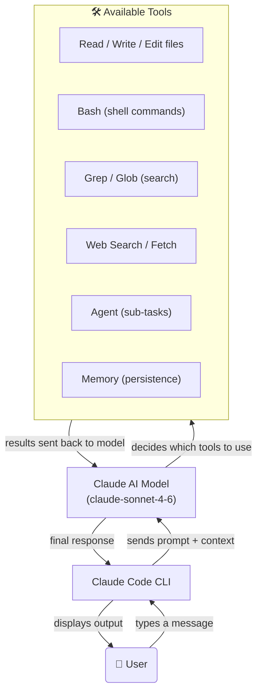

```mermaid
flowchart TD
    User("👤 User") -->|types a message| CLI["Claude Code CLI"]
    CLI -->|sends prompt + context| Model["Claude AI Model\n(claude-sonnet-4-6)"]
    Model -->|decides which tools to use| Tools

    subgraph Tools["🛠️ Available Tools"]
        T1["Read / Write / Edit files"]
        T2["Bash (shell commands)"]
        T3["Grep / Glob (search)"]
        T4["Web Search / Fetch"]
        T5["Agent (sub-tasks)"]
        T6["Memory (persistence)"]
    end

    Tools -->|results sent back to model| Model
    Model -->|final response| CLI
    CLI -->|displays output| User
```
